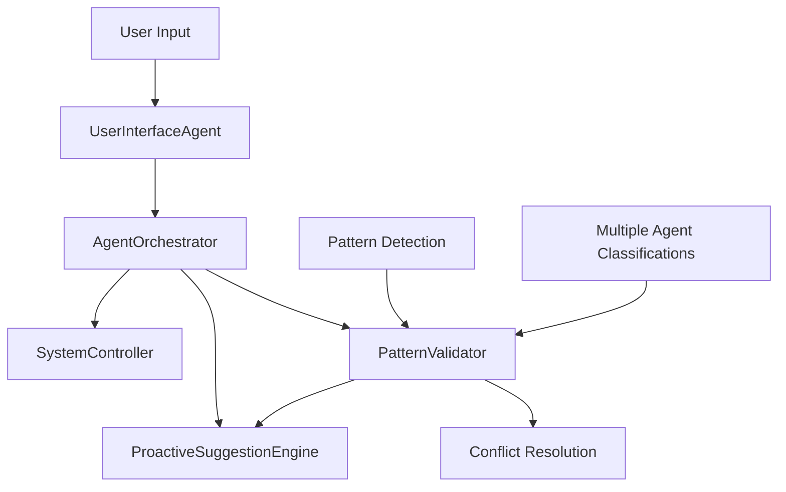

# CelFlow AI Agents: Quick I/O Reference

## 📊 Agent Input/Output Summary Table

| Agent | Primary Input | Primary Output | Key Features |
|-------|---------------|----------------|--------------|
| **🎭 UserInterfaceAgent** | `str` (user message) + context | `Dict` with AI response + metadata | Natural language processing, voice commands, proactive suggestions |
| **🎭 AgentOrchestrator** | `str` (task description) + context | `Dict` with task plan + execution results | Multi-agent coordination, task delegation, result synthesis |
| **🎛️ SystemController** | `str` (user command) + user context | `SystemAction` dataclass | Command translation, safety validation, system execution |
| **🔍 PatternValidator** | `PatternClassification` objects | `ValidationResult` + coherence metrics | Pattern validation, conflict resolution, system audits |
| **💡 ProactiveSuggestionEngine** | `SuggestionContext` dataclass | `List[ProactiveSuggestion]` | Context-aware suggestions, user feedback processing |

## 🔄 Common Data Flow Patterns



## 📝 Quick Integration Examples

### **Simple Chat Processing**
```python
# Input: User message
result = await ui_agent.process_chat_message(
    "Help me organize my tasks", 
    {"user_id": "user123"}
)
# Output: {"success": True, "message": "I can help you...", ...}
```

### **Complex Task Coordination**
```python
# Input: Task description
result = await orchestrator.coordinate_task(
    "Analyze productivity and suggest improvements",
    {"priority": "normal", "user_data": {...}}
)
# Output: {"success": True, "task_id": "task_0001", "orchestration_plan": {...}}
```

### **System Command Translation**
```python
# Input: Natural language command
action = await controller.translate_user_command(
    "Show running processes",
    {"user_id": "user123", "security_level": "standard"}
)
# Output: SystemAction dataclass with full analysis
```

### **Pattern Validation**
```python
# Input: Pattern classification
result = await validator.validate_single_pattern(pattern)
# Output: ValidationResult with coherence scores
```

### **Proactive Suggestions**
```python
# Input: User context
suggestions = await engine.generate_suggestions(context)
# Output: List of ProactiveSuggestion objects
```

## 🎯 Key Data Types

### **Common Input Types**
- `str` - Natural language text (messages, commands, descriptions)
- `Dict` - Context objects with metadata
- `Dataclass` - Structured objects (PatternClassification, SuggestionContext)
- `List` - Collections of related items

### **Common Output Types**
- `Dict` - Results with success/error status
- `Dataclass` - Complex structured responses
- `List` - Collections of suggestions/results
- `bool` - Simple validation results
- `float` - Confidence/quality scores (0.0-1.0)

### **Shared Patterns**
- **Success/Error**: `{"success": bool, "error": str}`
- **Timestamps**: ISO format strings
- **Confidence**: 0.0-1.0 float values
- **Agent ID**: String identifier in responses
- **Context**: Optional Dict for additional metadata

## 🔧 Testing Each Agent's I/O

```bash
# Test all agent inputs/outputs
python test_all_agents.py

# Test specific agent I/O
python test_all_agents.py --agent ui --verbose
python test_all_agents.py --agent orchestrator --verbose
python test_all_agents.py --agent system --verbose
python test_all_agents.py --agent pattern --verbose
python test_all_agents.py --agent suggestion --verbose
```

This quick reference helps developers understand the essential input/output patterns for integrating with CelFlow's AI agents. 